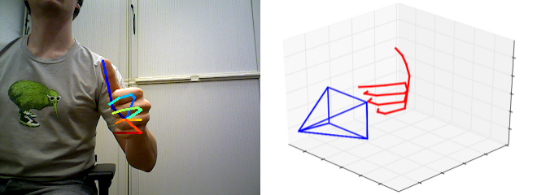

# ColorHandPose3D network

ColorHandPose3D is a Convolutional Neural Network estimating 3D Hand Pose from a single RGB Image. See the [project page](https://lmb.informatik.uni-freiburg.de/projects/hand3d/) for the dataset used and additional information.

## Usage: Forward pass
The network ships with a minimal example, that performs a forward pass and shows the predictions.

- Download [data](https://lmb.informatik.uni-freiburg.de/projects/hand3d/ColorHandPose3D_data_v3.zip) and unzip it into the projects root folder (This will create 3 folders: "data", "results" and "weights")
- *run.py* - Will run a forward pass of the network on the provided examples

You can compare your results to the content of the folder "results", which shows the predictions we get on our system.

## Recommended system
Recommended system (tested):
- Ubuntu 16.04.2 (xenial)
- Tensorflow 1.3.0 GPU build with CUDA 8.0.44 and CUDNN 5.1
- Python 3.5.2

Python packages used by the example provided and their recommended version:
- tensorflow==1.3.0
- numpy==1.13.0
- scipy==0.18.1
- matplotlib==1.5.3

## Preprocessing for training and evaluation
In order to use the training and evaluation scripts you need download and preprocess the datasets.

### Rendered Hand Pose Dataset (RHD)

- Download the dataset accompanying this publication [RHD dataset v. 1.1](https://lmb.informatik.uni-freiburg.de/resources/datasets/RenderedHandposeDataset.en.html)
- Set the variable 'path_to_db' to where the dataset is located on your machine
- Optionally modify 'set' variable to training or evaluation
- Run

		python3.5 create_binary_db.py
- This will create a binary file in *./data/bin* according to how 'set' was configured

### Stereo Tracking Benchmark Dataset (STB)
- For eval3d_full.py it is necessary to get the dataset presented in Zhang et al., ‘3d Hand Pose Tracking and Estimation Using Stereo Matching’, 2016
- After unzipping the dataset run

		cd ./data/stb/
		matlab -nodesktop -nosplash -r "create_db"
- This will create the binary file *./data/stb/stb_evaluation.bin*

## Network training
We provide scripts to train HandSegNet and PoseNet on the [Rendered Hand Pose Dataset (RHD)](https://lmb.informatik.uni-freiburg.de/resources/datasets/RenderedHandposeDataset.en.html).
In case you want to retrain the networks on new data you can adapt the code provided to your needs.

The following steps guide you through training HandSegNet and PoseNet on the Rendered Hand Pose Dataset (RHD).

- Make sure you followed the steps in the section 'Preprocessing'
- Start training of HandSegNet with training_handsegnet.py
- Start training of PoseNet with training_posenet.py
- Set USE_RETRAINED = True on line 32 in eval2d_gt_cropped.py
- Run eval2d_gt_cropped.py to evaluate the retrained PoseNet on RHD-e
- Set USE_RETRAINED = True on line 31 in eval2d.py
- Run eval2d.py to evaluate the retrained HandSegNet + PoseNet on RHD-e

You should be able to obtain results that roughly match the following numbers we obtain with Tensorflow v1.3:

eval2d_gt_cropped.py yields:

    Evaluation results:
    Average mean EPE: 7.630 pixels
    Average median EPE: 3.939 pixels
    Area under curve: 0.771

eval2d.py yields:

    Evaluation results:
    Average mean EPE: 15.469 pixels
    Average median EPE: 4.374 pixels
    Area under curve: 0.715

Because training itself isn't a deterministic process results will differ between runs.
Note that these results are not listed in the paper.

## Evaluation

There are four scripts that evaluate different parts of the architecture:

1. eval2d_gt_cropped.py: Evaluates PoseNet  on 2D keypoint localization using ground truth annoation to create hand cropped images (section 6.1, Table 1 of the paper)
2.  eval2d.py: Evaluates HandSegNet and PoseNet on 2D keypoint localization (section 6.1, Table 1 of the paper)
3.  eval3d.py: Evaluates different approaches on lifting 2D predictions into 3D (section 6.2.1, Table 2 of the paper)
3.  eval3d_full.py: Evaluates our full pipeline on 3D keypoint localization from RGB (section 6.2.1, Table 2 of the paper)

This provides the possibility to reproduce results from the paper that are based on the RHD dataset.

## License and Citation
This project is licensed under the terms of the GPL v2 license. By using the software, you are agreeing to the terms of the [license agreement](https://github.com/lmb-freiburg/hand3d/blob/master/LICENSE).

Please cite us in your publications if it helps your research:

	@InProceedings{zb2017hand,
	  author    = {Christian Zimmermann and Thomas Brox},
	  title     = {Learning to Estimate 3D Hand Pose from Single RGB Images},
	  booktitle    = "IEEE International Conference on Computer Vision (ICCV)",
	  year      = {2017},
	  note         = "https://arxiv.org/abs/1705.01389",
	  url          = "https://lmb.informatik.uni-freiburg.de/projects/hand3d/"
	}

## Known issues

- There is an issue with the results of section 6.1, Table 1 that reports performance of 2D keypoint localization on full scale images (eval2d.py). PoseNet was trained to predict the "palm center", but the evaluation script compares to the "wrist". This results into an systematic error and therefore the reported results are significantly worse than under a correct evaluation setting. Using the correct setting during evaluation improves results approximately by 2-10% (dependent on the measure).
- The numbers reported for the "Bottleneck" approach in Table 2 of the paper are not correct. The actual result are approx. 8 % worse.
- There is a minor issue with the first version of RHD. There was a rounding/casting problem, which led to values of the images to be off by one every now and then compared to the version used in the paper. The difference is visually not noticable and not large, but it prevents from reaching the reported numbers exactly.
